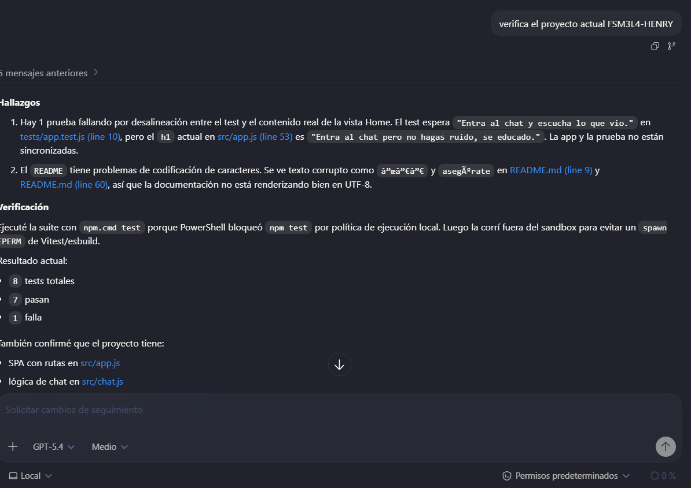
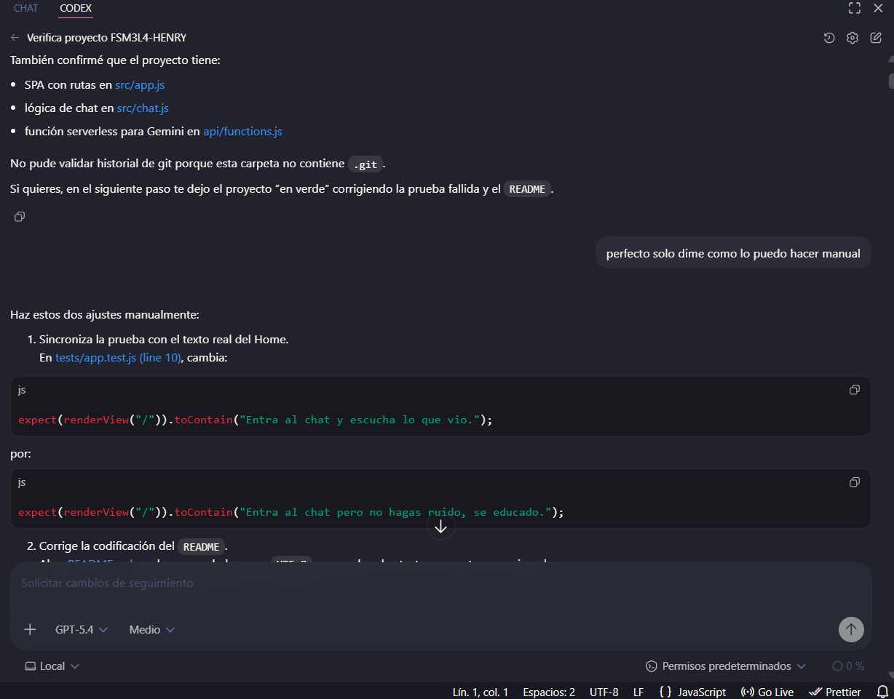
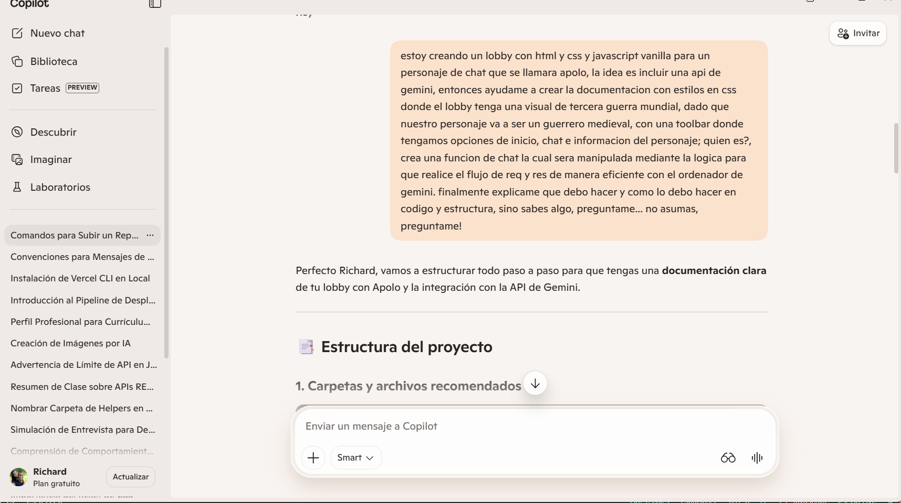
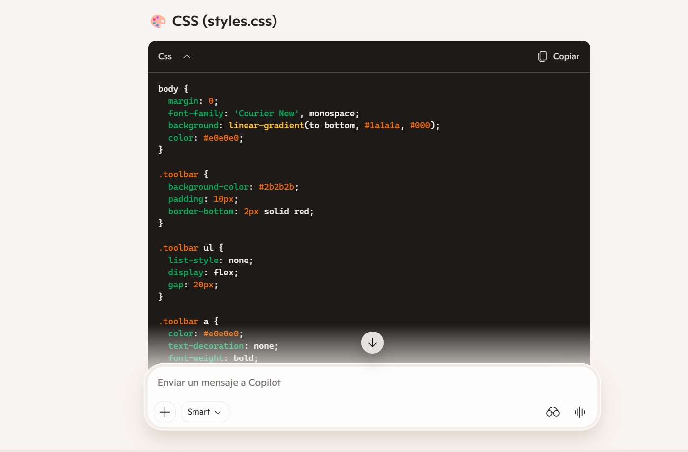
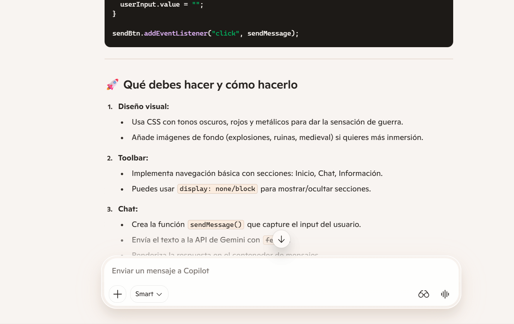
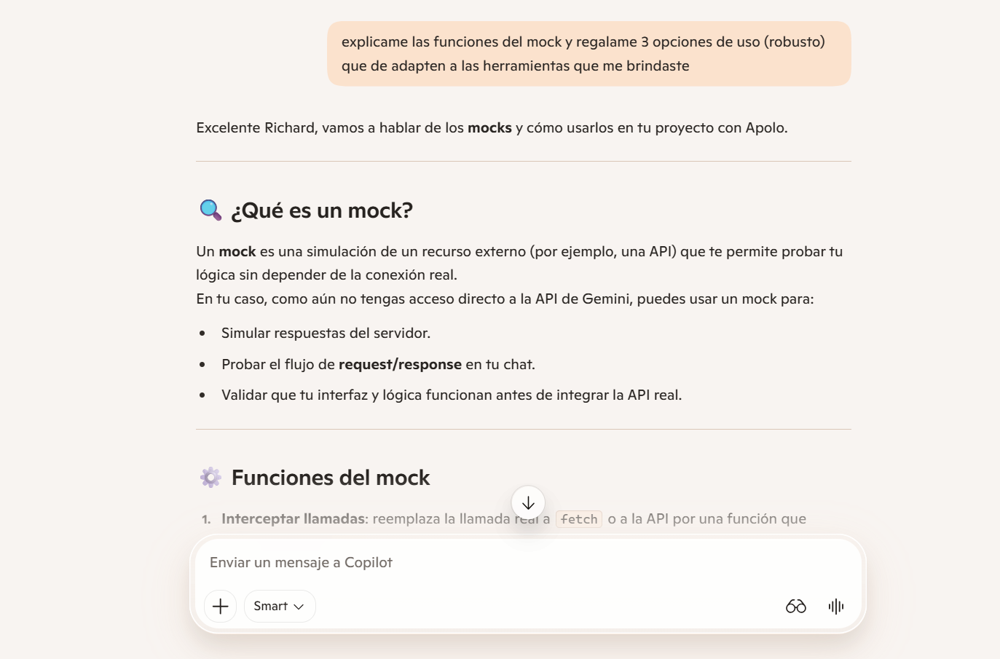
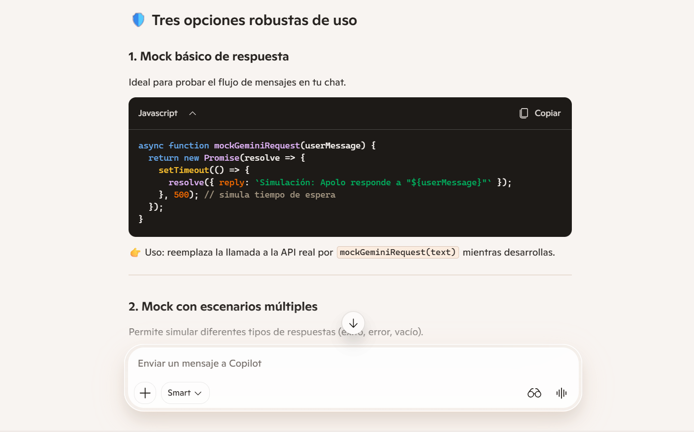
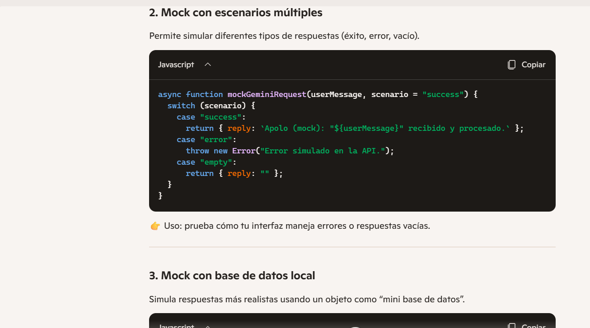

# Fictional Character Chat SPA

Single Page Application responsive para chatear con un personaje ficticio usando Google Gemini API a traves de una Vercel Serverless Function.

## Vista general

| Indicador | Estado |
|---|---|
| Routing SPA | History API con `pushState` y `popstate` |
| UI responsive | Mobile-first con 3 breakpoints |
| Chat IA | Gemini 2.5 Flash |
| Persistencia | `sessionStorage` |
| Estados visuales | loading, retry, error, truncado |
| Tests | `11/11` en verde |

## Flujo de la app

```text
Usuario
  |
  v
Lobby SPA -> Router -> Vista Home / Chat / About
                    |
                    v
               Chat con Apolo
                    |
                    v
          requestCharacterReply()
                    |
                    v
             /api/functions
                    |
                    v
           Google Gemini API
                    |
                    v
      reply + stopReason + truncated
                    |
                    v
         Render del mensaje en UI
```

## Flujo del chat

```text
Input del usuario
  -> validacion de longitud
  -> debounce
  -> bloqueo por isLoading
  -> guardado en historial
  -> request al backend
  -> parseo de respuesta
  -> render de Apolo
  -> scroll automatico
```

## Estructura

```text
project-root/
|-- api/
|   `-- functions.js
|-- public/
|   |-- apolo-hero.png
|   |-- apolo-about.png
|   `-- apolo-chat.png
|-- tests/
|   |-- utils.test.js
|   `-- app.test.js
|-- .env
|-- .env.example
|-- app.js
|-- chat.js
|-- index.html
|-- styles.css
|-- utils.js
|-- variables.js
|-- package.json
`-- README.md
```

## Soporte de uso de IA

Esta seccion documenta el uso de agentes de IA como apoyo en el desarrollo, depuracion y fortalecimiento del proyecto. Las capturas se incluyen como evidencia del proceso y como soporte de decisiones tecnicas.

### Evidencia visual

#### Codex





#### Copilot













### Analisis comparativo de respuestas IA

#### Respuestas utilizadas porque aportaron bien al proyecto

- Las observaciones de Codex sobre pruebas desalineadas y problemas de codificacion del `README` fueron utiles porque detectaron fallos reales del repositorio y se tradujeron en correcciones concretas.
- La orientacion de Copilot sobre estructura general, separacion por archivos y flujo de request/response ayudo como punto de partida conceptual para ordenar la SPA.
- La explicacion de Copilot sobre mocks si fue aprovechable porque reforzo la idea de probar la logica del chat sin depender siempre de la API real. Esa linea de trabajo termino integrandose en la suite con tests sobre `requestCharacterReply()`.
- Las respuestas de IA que proponian validaciones, manejo de estados y documentacion tecnica sumaron porque iban alineadas con la rubrica del proyecto: pruebas, robustez, claridad de arquitectura y experiencia de usuario.

#### Respuestas no utilizadas tal cual y por que no convenia adoptarlas sin ajuste

- Parte de la estructura sugerida por Copilot no se uso literalmente porque hablaba de rutas y carpetas que no coincidian con el estado real del repo. El proyecto termino consolidado con archivos en raiz y no con la distribucion exacta sugerida.
- El CSS inicial sugerido por IA servia como referencia visual, pero era demasiado basico para la identidad final del lobby. Se rehizo con una direccion mas coherente con Apolo, mejor responsividad y una composicion mas cinematica.
- La recomendacion de usar `display: none/block` para navegar se descarto como solucion principal porque la rubrica exigia routing SPA real con `pushState` y `popstate`, no solo ocultar secciones.
- Los ejemplos de mock de Gemini que devolvian objetos simples con `reply` se tomaron como referencia pedagogica, pero no se pegaron tal cual porque el proyecto ya tenia un cliente real, manejo de errores, truncamiento, retries y contrato de respuesta especifico.
- Varias respuestas de IA eran utiles como borrador, pero no como implementacion final. Se usaron solo despues de contrastarlas con el contexto del proyecto, la estructura real del codigo y los requerimientos de la evaluacion.

### Criterio de uso de IA en este proyecto

- La IA se uso como apoyo para detectar fallos, proponer rutas de solucion y acelerar documentacion.
- Ninguna sugerencia se incorporo automaticamente sin revision del contexto del proyecto.
- Se priorizaron respuestas que ayudaran a cumplir la rubrica: SPA funcional, UX clara, system prompt consistente, pruebas en verde y estructura mantenible.
- Las propuestas demasiado genericas o desalineadas con la arquitectura real se descartaron o se adaptaron antes de implementarse.

## Variables de entorno

Usa `.env.example` como referencia:

```bash
GEMINI_API_KEY=your_gemini_api_key_here
GEMINI_MODEL=gemini-2.5-flash
GEMINI_TEMPERATURE=0.2
GEMINI_MAX_TOKENS=520
```

## Scripts

```bash
npm install
npm test
npm run dev
npx vercel dev
```

## Nota de uso

- `npm run dev` sirve bien la SPA.
- `npx vercel dev` es la forma mas confiable de probar la SPA junto con `api/functions`.
- Si Apolo sigue saliendo recortado, sube `GEMINI_MAX_TOKENS` en tu `.env` real y reinicia el servidor.
